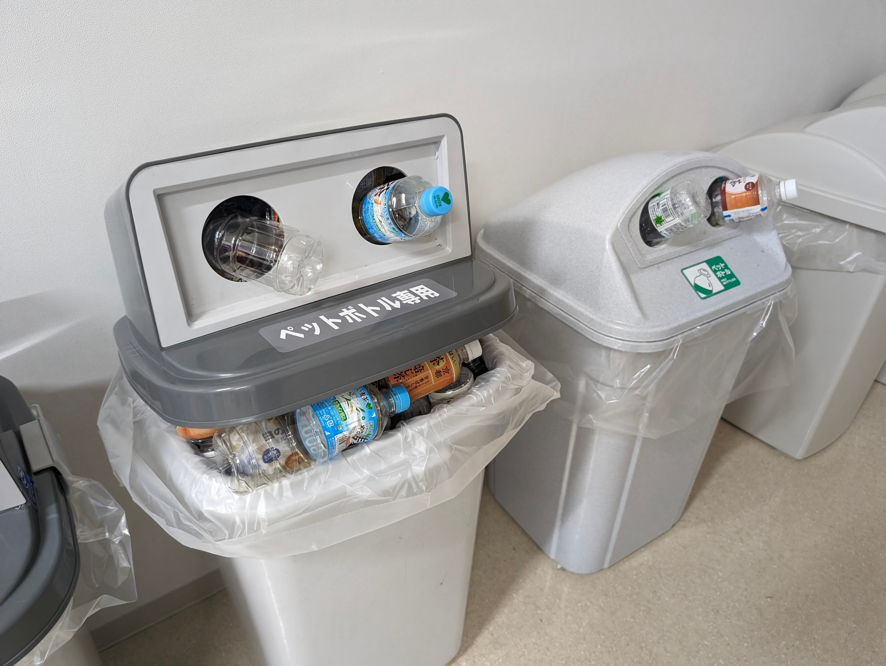

# 技術メモ

[プレイリーカード](https://my.prairie.cards/u/smpi.un)

[rss](https://github.com/smpi-un/knowledge/commits/main.atom)

* TOC

{:toc}

## Link
- [https://my.prairie.cards/u/smpi.un](https://my.prairie.cards/u/smpi.un)

## Sub documents
- [services](./services/)
- [githubpage](./githubpage)
- [env](./env)
- [python](./python/)
- [languages](./languages/)
- [recipes](./recipes/)
- [apis](./apis/)
- [products](./products/)

- [ ] FESS(ラズパイ？)
- [x] Canvas LMS
- [x] Open Project
## 気になるもの

https://book.mynavi.jp/manatee/about/
https://qiita.com/nyanko-box/items/52aace19cb99fb1146c2

大量に溜まった自炊PDFに対し、OCRデータ＋１ページ目の画像をVision AIに渡してタイトル付してフォルダも分けてほしい。

streamlitを活用できなか？

[文字起こし](文字起こし.ipynb)
## アイデアメモ
### 差分通知
あらかじめ設定したURLを毎日定時にデータ取得し、テキスト情報のみ抽出。
昨日分との差分を取る。
その情報を生成AIに渡して、何が更新されたかをメールなどで通知する。

### 広報DL
広報新しいのでたらダウンロードする。LINEとかで通知されるのをトリガーに。
だってめんどうじゃん。

### VisionAIでPDF振り分け
自炊データがたくさんあるのです。OCR併用もいい。

### ローカルトリガー
クリップボードやファイルの監視だけする簡易ソフト
トリガー後の動作はバッチ起動とかWebhookとかかんたんなののみ用意しておく。
スクリプト拡張もいいかも。悪意のある人がいなければ。

### Streamlit
- geminiにgptも追加
- OCR部分はEasyOCR使う

## 成果物リンク
### CrunePDF
PDF正立。Windowsのみ。
[https://github.com/smpi-un/CrunePDF](https://github.com/smpi-un/CrunePDF)

### [作りかけ] [KMSearch](products/kmsearch)
画像やPDFに対してOCRかけてファイル内検索。ついでにExcelとかも検索できるかも。
[https://github.com/smpi-un/KMSearch](https://github.com/smpi-un/KMSearch)

### [作りかけ] File2QR
ファイルをQRコードに変換。小さいサイズなら受け渡しに使えるかも。
[https://github.com/smpi-un/File2QR](https://github.com/smpi-un/File2QR)

### cclip
クリップボードから情報取得する。Windowsのみ。
[https://github.com/smpi-un/cclip](https://github.com/smpi-un/cclip)

# ?
